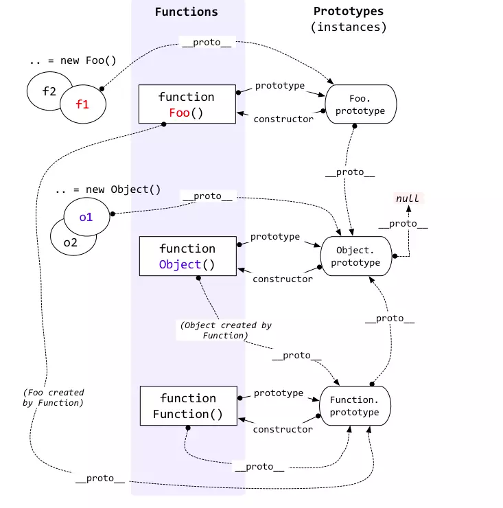
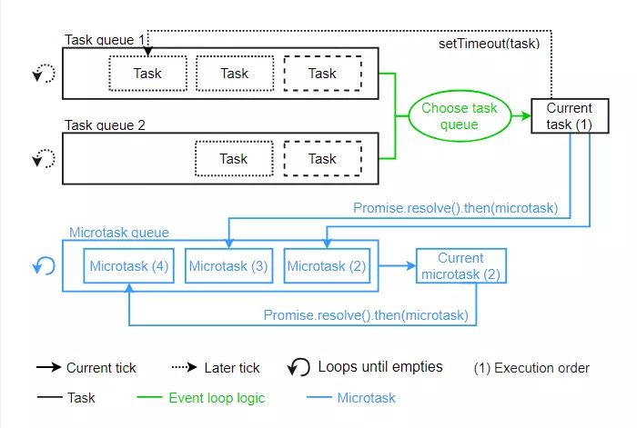

```
作者：倔强的石头
链接：https://juejin.im/post/5c19c1b6e51d451d1e06c163
来源：掘金
著作权归作者所有。商业转载请联系作者获得授权，非商业转载请注明出处。
```

> 又到年尾了，各位小伙伴的心可能又蠢蠢欲动了。。。
> 得不到的永远在骚动，被偏爱的都有恃无恐。。。

作为一个前端菜鸟的我，面试经验和工作经验并不丰富，但大大小小也面试过不少互联网圣地，今天就讲讲笔者今年初面试鹅厂的经验，希望对大家有所帮助！后面的答案为自行整理，如有疏漏，欢迎指正！

## 先说整体情况

适用范围： 一到两年的菜鸟前端开发工程师

笔者情况： 笔者一共面试了好几轮技术面，最终结果技术面通过。

笔者感言： 可能是鹅厂大佬感觉我的经验不丰富的原因，感觉面试的大部分问题都是以基础为主。个人感觉大厂还是非常重视基础的，特别是对工作经验尚浅或者是校招生而言。所以

**重视基础和原理**

**重视基础和原理**

**重视基础和原理**

## 正文走起来

以下，笔者会结合面试官问的问题一一道来...

## 一面——那是一个电话

腾讯面试官（小腾）：你好，我是腾讯面试官，巴拉巴拉......先自我介绍一下（声音特别温柔 😝）！

笔者：我...

小腾：那我们就简单的聊一下一些基础的前端知识！

。。。。。。

这通面试电话，面试官主要问了我 4 个前端相关问题。

1. 知道什么是事件委托吗？
2. 对 Promise 了解吗？
3. window 的 onload 事件和 domcontentloaded 谁先谁后？
4. 你之前遇到过跨域问题吗？是怎么解决的。

众人皆知，不以结婚为目的的恋爱都是耍流氓，额，不，跑题了 😁。。。不给答案的面试题都是来骗点击量的 😝！！！由于这些问题实在过于简单，但是涉及面又挺广的，还请大家自行百度（千万不要因为这个不给我赞，你的赞是宝宝持续分享的动力 QAQ）。

### 二面——QQ 远程面

啊呀，罗里吧嗦的，老太婆的裹脚布...，我写到这里，被主管劈头盖脸就是一顿！现在的年轻人时间宝贵，喜欢干货，不喜欢你这磨磨唧唧的！如此，只能干货先行了（大家如果喜欢我的行文风格，就点个赞，或者评论一下呗，笔者特别想怼一下那个主管）！

干货如下，答案为自己整理，如果有误，欢迎指出！

1. 有一个类如下：

```js
function Person(name) {
  this.name = name;
}
let p = new Person("Tom");
```

1. p.**proto**等于什么？
   答案：
   Person.prototype

2. Person.**proto**等于什么？
   答案：
   Function.prototype
   解析：
   1，2 两问其实问的是同一个问题，都是考察原型链相关的知识，我们只需要记住一句话就可以迎刃而解。实例的**proto**属性（原型）等于其构造函数的 prototype 属性。实例 p 的构造函数为 Person，而 Person 的构造函数为 Function，结果就一目了然了。

   **触类旁通**

   ````js
   var foo = {},
   F = function(){};
   Object.prototype.a = 'value a';
   Function.prototype.b = 'value b';
   console.log(foo.a)
   console.log(foo.b)
   console.log(F.a)
   console.log(F.b)
    ```
   ````

复制代码这里就不给答案了，大家自己分析一下，然后再去控制台运行一下吧！冬天到了，动动手，暖一暖，有木有觉得笔者还是相当的贴心的！！！

3. 若将题干改为

```js
function Person(name) {
  this.name = name;
  return name;
}
let p = new Person("Tom");
```

实例化 Person 过程中，Person 返回什么（或者 p 等于什么）？

答案：

```js
{
  name: "Tom";
}
```

4. 若将题干改为

```js
function Person(name) {
  this.name = name;
  return {};
}
let p = new Person("Tom");
```

实例化 Person 过程中，Person 返回什么（或者 p 等于什么）？

答案：`{}`

解析

构造函数不需要显示的返回值。使用 new 来创建对象(调用构造函数)时，如果 return 的是非对象(数字、字符串、布尔类型等)会忽而略返回值;如果 return 的是对象，则返回该对象(注：若 return null 也会忽略返回值）。

5. `typeof` 和 `instanceof` 的区别
   答案：

在 JavaScript 中，判断一个变量的类型尝尝会用 typeof 运算符，在使用 typeof 运算符时采用引用类型存储值会出现一个问题，无论引用的是什么类型的对象，它都返回 “object”。

`instanceof` 运算符用来测试一个对象在其原型链中是否存在一个构造函数的 prototype 属性。
语法：`object instanceof constructor`
参数：`object`（要检测的对象.）`constructor`（某个构造函数）
描述：`instanceof` 运算符用来检测 `constructor.prototype` 是否存在于参数 `object` 的原型链上。

答案是我整理后的，可能觉得我回答的并不准确，面试官又举了一个例子给我。

6. 如果 `Student inherit from Person`（`Student` 类继承 `Person`，需是基于原型的继承），`let s = new Student('Lily')`，那么 `s instanceof Person` 返回什么？

```js
function Person(name) {
  this.name = name;
}

function Student() {}

Student.prototype = Person.prototype;
Student.prototype.constructor = Student;

let s = new Student("Tom");
console.log(s instanceof Person); // 返回 true
```

答案：

```js
true;
```

7. new 和 instanceof 的内部机制
   答案
   1. 创建一个新对象，同时继承对象类的原型，即 Person.prototype；
   2. 执行对象类的构造函数，同时该实例的属性和方法被 this 所引用，即 this 指向新构造的实例；
   3. 如果构造函数 return 了一个新的“对象”，那么这个对象就会取代整个 new 出来的结果。如果构造函数没有 return 对象，那么就会返回步骤 1 所创建的对象，即隐式返回 this。（一般情况下构造函数不会返回任何值，不过在一些特殊情况下，如果用户想覆盖这个值，可以选择返回一个普通的对象来覆盖。）

用代码来阐述

```js
// let p = new Person()
let p = (function () {
let obj = {};
obj.**proto** = Person.prototype;

// 其他赋值语句...

return obj;
})();
```

下面通过代码阐述 `instanceof` 的内部机制，假设现在有 `x instanceof y` 一条语句，则其内部实际做了如下判断：

```js
while(x.**proto**!==null) {
if(x.**proto**===y.prototype) {
return true;
break;
}
x.**proto** = x.**proto**.proto**;
}
if(x.**proto**==null) {return false;}
```

x 会一直沿着隐式原型链**proto**向上查找直到 x.**proto**.\*\*proto\_\_......===y.prototype 为止，如果找到则返回 true，也就是 x 为 y 的一个实例。否则返回 false，x 不是 y 的实例。

**触类旁通**

```js
function F() {}
function O() {}

O.prototype = new F();
var obj = new O();

console.log(obj instanceof O); // true
console.log(obj instanceof F); // true
console.log(obj.**proto** === O.prototype); // true
console.log(obj.**proto**.**proto** === F.prototype); // true
```

根据 `new`的内部机制改写上面代码

```js
function F() {}
function O() {}

var obj = (function () {
var obj1 = {};
obj1.**proto** = F.prototype; // new F();
O.prototype = obj1; // O.prototype = new F();
obj.**proto** = O.prototype; // new O();
obj.**proto** = obj1;
return obj;
})
```

结合 `instanceof` 内部机制很容易得出正确答案。

如果稍微调整一下代码顺序，结果将迥然不同

```js
function F() {}
function O() {}

var obj = new O();
O.prototype = new F();

console.log(obj instanceof O); // false
console.log(obj instanceof F); // false
console.log(obj.**proto** === O.prototype); // false
console.log(obj.**proto**.**proto** === F.prototype); // false
```

具体原因，请读者自行分析，如果还是有疑问，可以在评论区提出！

其实上面很多问题都是考察原型链相关的知识，这里给出一张必须理解的原型链图，原谅我盗了一张图。



问到这里我的脑袋已经有点浆糊了，原谅我太菜了！！

8. 下面代码输出什么？

```js
for (var i = 0; i < 10; i++) {
  setTimeout(() => {
    console.log(i);
  }, 0);
}
```

答案: 10 个 10

若要输出从 0 到 9，怎么办？

答案:
将 var 改为 let，或者使用闭包。

```js
// 使用闭包
for (var i = 0; i < 10; i++) {
  (function(i) {
    setTimeout(() => {
      console.log(i);
    }, 0);
  })(i);
}
```

9. 刚刚我们用到了箭头函数，说一下箭头函数 This 指向问题？
   答案：
   默认指向在定义它时,它所处的对象,而不是执行时的对象,定义它的时候,可能环境是 window（即继承父级的 this）。
   如果对 This 还有不清楚的地方，可以参考我的另一篇文章彻底理解 JavaScript 中的 this。

10. for...in 迭代和 for...of 有什么区别？
    答案：for...in 和 for...of 的区别

11. 说一下你对 generator 的了解？
    答案： 建议大家查看阮一峰老师的 generator 相关章节

12. 使用过 flex 布局吗？flex-grow 和 flex-shrink 属性有什么用？
    答案： flex-grow：项目的放大比例，默认为 0，即如果存在剩余空间，也不放大。flex-shrink：项目的缩小比例，默认为 1，即如果空间不足，该项目将缩小。
    想彻底理解 flex，可以查看阮一峰老师的 Flex 布局教程：语法篇

13. 说一下 macrotask 和 microtask？并说出下面代码的运行结果。

```js
console.log("a");

setTimeout(() => {
  console.log("b");
}, 0);

console.log("c");

Promise.resolve()
  .then(() => {
    console.log("d");
  })
  .then(() => {
    console.log("e");
  });

console.log("f");
```

复制代码答案： 输出结果为 acfdeb，而关于 macrotask 和 microtask 可以继续留意笔者后篇文章，亦可自行搜索。不过可以看一下盗的一张图。



14. Http 请求中的 keep-alive 有了解吗。

答案：

在 http 早期，每个 http 请求都要求打开一个 tpc socket 连接，并且使用一次之后就断开这个 tcp 连接。

使用 keep-alive 可以改善这种状态，即在一次 TCP 连接中可以持续发送多份数据而不会断开连接。通过使用 keep-alive 机制，可以减少 tcp 连接建立次数，也意味着可以减少 TIME_WAIT 状态连接，以此提高性能和提高 httpd 服务器的吞吐率(更少的 tcp 连接意味着更少的系统内核调用,socket 的 accept()和 close()调用)。

但是，keep-alive 并不是免费的午餐,长时间的 tcp 连接容易导致系统资源无效占用。配置不当的 keep-alive，有时比重复利用连接带来的损失还更大。所以，正确地设置 keep-alive timeout 时间非常重要。

15. React 中的 controlled component 和 uncontrolled component 区别（受控组件和不受控组件）。
    答案： ： 请查阅 React 官网受控组件，非受控组件

16. 了解过 react-router 内部实现机制吗？
    答案：请看这篇文章 react-router 的实现原理

17. 数组扁平化处理：实现一个 flatten 方法，使得输入一个数组，该数组里面的元素也可以是数组，该方法会输出一个扁平化的数组。

```js
    // Example
let givenArr = [[1, 2, 2], [3, 4, 5, 5], [6, 7, 8, 9, [11, 12, [12, 13, [14]]]], 10];

let outputArr = [1,2,2,3,4,5,5,6,7,8,9,11,12,12,13,14,10]

// 实现 flatten 方法使得
flatten(givenArr)——>outputArr
```

年轻的我是用递归实现的 QAQ，我的答案

```js
function flatten(arr) {
  var res = [];
  for (var i = 0; i < arr.length; i++) {
    if (Array.isArray(arr[i])) {
      res = res.concat(flatten(arr[i]));
    } else {
      res.push(arr[i]);
    }
  }
  return res;
}
```

其实你还可以这样

```js
function flatten(arr) {
  return arr.reduce(function(prev, item) {
    return prev.concat(Array.isArray(item) ? flatten(item) : item);
  }, []);
}
```

还可以使用 ES6 拓展运算符

```js
function flatten(arr){
while(arr.some(item=>Array.isArray(item)){
arr = [].concat(...arr);
}
return arr;
}
```

18. 如果在 17 问的前提下，要做去重和排序处理又该怎么做（不用给出具体代码）。

答案：最好封装一个数组方法的类，该类包含 flatten(扁平化)、sort(排序)和 unique(去重)等方法。
二面就这样过去了，怀着忐忑的心情等待结果中，文章有点长了，欲知后面的面试题，请听下回分解!!!
